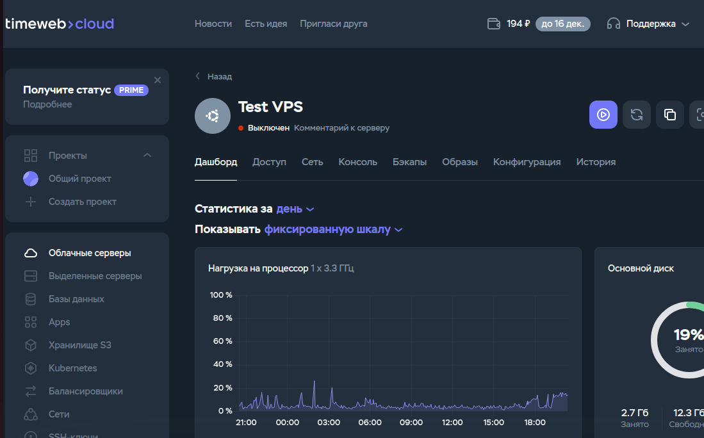
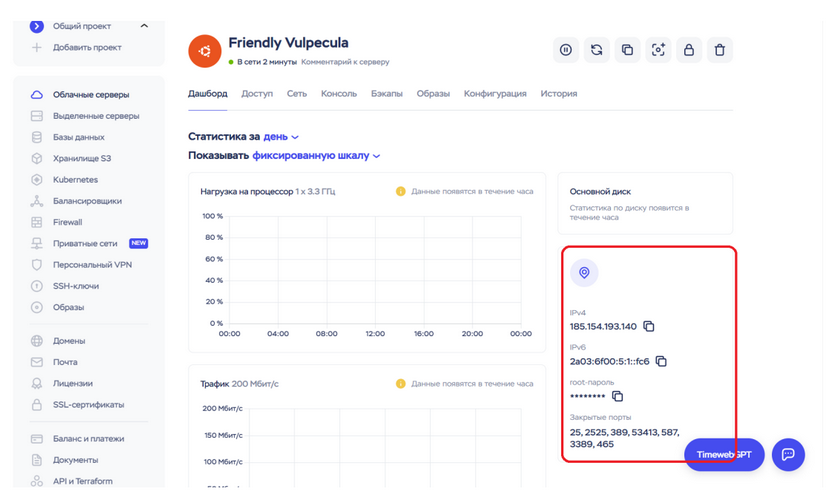

<div id="header" align="center">
    <h1>Подключение к виртуальному VPS серверу по SSH </h1>
</div>

* Запустите сервер



* Введите команду вида:

```ssh root@ip_адрес_сервера```

Пароль можно взять на даш-борде:



* Подтвердите соединение
* Введите пароль (берем из даш-борда)
