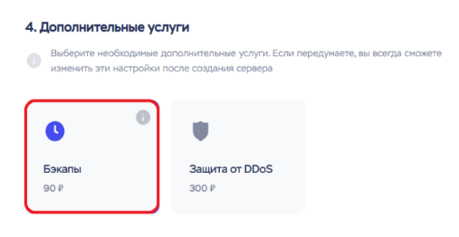

    <h1>Краткий гайд по аренде vps</h1>

    <h3>Создание сервера</h3>

Переходим на официальный сайт **TimeWeb** и регистрируемся по [ссылке](https://timeweb.cloud/my/registration).

Выбираем **Облачные серверы**

Выбираем **операционную систему**

Выбираем **регион** (его можно сменить в любое время)

Определяем **конфигурацию** (также можно изменить позже)

Отключаем **дополнительные услуги**, чтобы удешевить обслуживание (можно всегда изменить)

Задаем **имя сервера** и **комментарий** (если нужно)

Нажимаем кнопку **заказать**

Дожидаемся **создания сервера** (данные придут на почту)

Копируем **пароль** (можно из **дашборда**)

    <h3>Вход на сервер</h3>

Переходим в **консоль**

Вводим логин (**root**) и пароль (копируем из **дашборда**)
